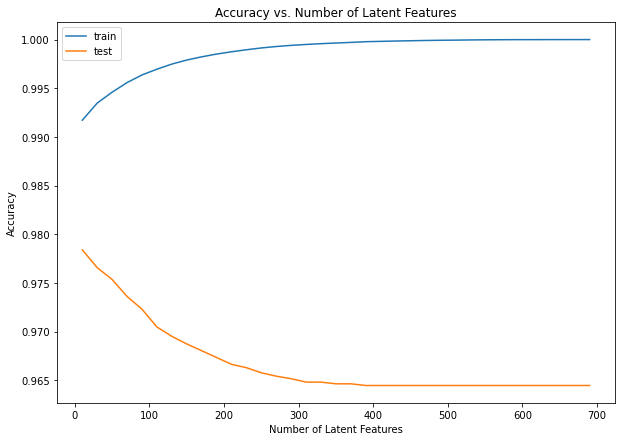

# Recommendations with IBM

The purpose of this project is to analyze the interactions that users have with articles on the [IBM Watson Studio platform](https://www.ibm.com/cloud/watson-studio), and make recommendations, based on a number of recommendation techniques to them about new articles they may like.

### Presentation

An `.html` version of the Jupyter notebook is included in the repository files.

### Output - Results



Train and test datasets have only 20 users in common that we can use to make predictions and test our model. This is usually considered a small number of users to draw meaningful conclusions. We can observe that accuracy in the test dataset decreases as the number of latent features (k) increases, starting close to 98% for a few latent features and stabilizing to around 96.5% for 400 – 700 latent features. This is reversely proportional to what happens with accuracy in the training data.

Looking at the training dataset results we observe that accuracy is extremely high (above 99%) even for a few latent features. This points to a known problem with matrix factorization with SVD, usually mentioned as overfitting. This becomes even worse for high numbers of latent features. For `k = 10` latent features there are `Ik + Uk` (`I` for items, `U` for users) parameters to estimate, i.e. `1051*10 + 5148*10 = 61990`. These need to be estimated from the `40000` training examples which are much less. To avoid this in practice regularization is used with gradient descent technique.

### TL;DR

Accuracy might not be the right metric to use for our case as more than 99% of the entries in the `user_item` matrix are zeros. This is what makes the model show such a high accuracy score, but of low practical value as it mainly predicts zeros.

Nevertheless, given the circumstances, to determine if the recommendations we make with any of the above recommendation systems are an improvement to how users currently find articles, we could propose an experiment. This could be in the form of an A/B/C test with a control group and two experimental groups representing the rank-based recommendations and SVD-based recommendations. We could ask users to provide feedback on the recommended articles in the form of like/dislike. We could also measure the total number of article interactions for each user and the ranking of articles for each group. Sampling would also require consideration and planning for the number of total samples required and the proportions among the three groups.

## Environment

The development environment used for working with the project was created on a Windows 10 pc with [devcontainers](https://code.visualstudio.com/docs/remote/containers).

The environment in the container is:

- Python 3.8.10

The main libraries used for this project are ([`requirements.txt`](requirements.txt) includes dependencies):

- jupyter
- pandas
- numpy
- matplotlib

The environment has been created with miniconda and using the included `requirements.txt` the environment can be recreated as:

```bash
$ conda create --name <env> --file <requirements.txt>
```

## Files and project file structure

Important files:

- `data` is the where the data given as input is kept.
- `requirements.txt` contains the required python libraries to crete the workspace environment.
- `.vscode` directory is for setting up [Visual Studio Code](https://code.visualstudio.com/) and debug configurations.
- `Recommendations_with_IBM.ipynb` the jupyter notebook containing analysis and results.
- `Recommendations_with_IBM.html` a snapshot of the notebook for presentation purposes.

## Acknowledgments

- This project has been created as part of the [Udacity Data Science Nanodegree](https://www.udacity.com/course/data-scientist-nanodegree--nd025) course.
- Data is provided by [IBM Watson Studio platform](https://www.ibm.com/cloud/watson-studio).